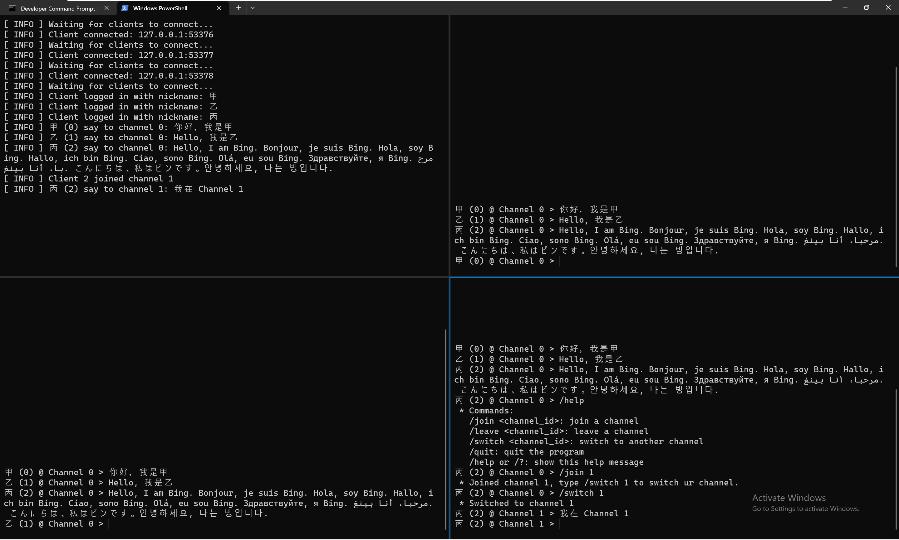
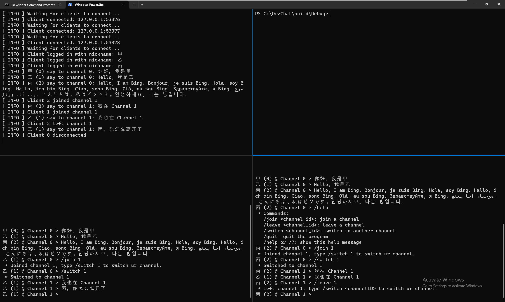

# 计算机网络实验报告
## 利用Socket编写一个聊天程序
> 物联网安全 2112052 郭大玮

## 协议设计

每个报文都由一个报文头和一个报文体组成

### 报文头：
```
Message Header
+------------+---------+--------------+
| MagicNumber|  Type   | PayloadLength|
+------------+---------+--------------+
|  O r z C   | 1 byte  |    4 bytes   |
+------------+---------+--------------+
|                                     |
|              Payload                |
|                                     |
+-------------------------------------+
```
```cpp
typedef struct {
    uint32_t magic_number;
    uint8_t type;
    uint32_t payload_length;
} MessageHeader;
```
MagicNumber: 固定的 4 字节，用于标识报文的开始，ASCII码为`OrzC`，0x4F727A43
Type: 报文类型，1 字节，见下表

| Type | Name | Description |
| ---- | ---- | ----------- |
| 0x00 | LOGIN | 登录 |
| 0x01 | JOIN_CHANNEL | 加入频道 |
| 0x02 | SEND_MSG | 发送消息 |
| 0x03 | LEAVE_CHANNEL | 离开频道 |
| 0x04 | DISCONNECT | 断开连接 |
| 0x05 | LOGIN_SUCCESS | 登录成功 |
| 0x06 | JOIN_CHANNEL_SUCCESS | 加入频道成功 |
| 0x07 | NEW_MSG | 新消息 |
| 0x08 | LEAVE_CHANNEL_SUCCESS | 离开频道成功 |
| 0x09 | ERR | 错误 |

*其中，0x00-0x04 为客户端发送给服务器的报文，0x05~0x09为服务器发送给客户端的报文
PayloadLength: 报文体的长度，4 字节
Payload: 报文体，根据 Type 的不同，报文体的结构不同，具体见下文

### 登录报文体：

```
Login Payload
+----------------+
|    Nickname    |
+----------------+
|    64 bytes    |
+----------------+
```
```cpp
typedef struct {
    wchar_t nickname[32];
} LoginPayload;
```
Nickname: 昵称，UTF-16LE 编码，最多 32 个字符

### 登录成功报文体：

```
LoginSuccess Payload
+----------+---------------+-----------+-----------+-------+
|  UserID  | ChannelAmount | ChannelID | ChannelID |  ...  |
+----------+---------------+-----------+-----------+-------+
|  4 bytes |    4 bytes    |  4 bytes  |  4 bytes  |  ...  |
+----------+---------------+-----------+-----------+-------+
```
```cpp
typedef struct {
    uint32_t user_id;
    uint32_t channel_amount;
} LoginSuccessPayload;
```

UserID: 为用户分配的唯一ID，4 字节
ChannelAmount: 服务器上现有的频道数量，4 字节
下面接着 ChannelAmount 个 ChannelID，每个 ChannelID 为 4 字节
注：Channel 0 为默认频道，所有用户都会加入


### 加入频道报文体：

```
JoinChannel Payload
+----------+-----------+
|  UserID  | ChannelID |
+----------+-----------+
|  4 bytes |  4 bytes  |
+----------+-----------+
```
```cpp

typedef struct {
    uint32_t user_id;
    uint32_t channel_id;
} JoinChannelPayload;
```

UserID: 用户 ID，4 字节
ChannelID: 要加入的频道 ID，4 字节

### 加入频道成功报文体：

```
JoinChannelSuccess Payload
+----------+-----------+
|  UserID  | ChannelID |
+----------+-----------+
|  4 bytes |  4 bytes  |
+----------+-----------+
```
返回报文与加入频道报文相同

### 发送消息报文体：

```
SendMsg Payload
+----------+-----------+----------+-----------+----------+
|  UserID  | ChannelID | Nickname | MsgLength |   Msg    |
+----------+-----------+----------+-----------+----------+
|  4 bytes |  4 bytes  | 64 bytes |  4 bytes  |  ...     |
+----------+-----------+----------+-----------+----------+
```
```cpp
typedef struct {
    uint32_t user_id;
    uint32_t channel_id;
    wchar_t nickname[32];
    uint32_t msg_length;
} SendMsgPayload;
```

UserID: 用户ID，4字节
ChannelID: 频道ID，4字节
Nickname: 发送者昵称，UTF-16LE编码，最多32个字符
MsgLength: 消息长度，4字节
Msg: 消息，UTF-16LE编码

### 新消息报文体：

```
NewMsg Payload
+----------+-----------+----------+-----------+----------+
|  UserID  | ChannelID | Nickname | MsgLength |   Msg    |
+----------+-----------+----------+-----------+----------+
|  4 bytes |  4 bytes  | 64 bytes |  4 bytes  |  ...     |
+----------+-----------+----------+-----------+----------+
```

当服务器收到发送消息报文后，会给所有在该频道的用户发送一个新消息报文
UserID: 消息发送者 ID，4 字节
ChannelID: 频道 ID，4 字节
Nickname: 消息发送者昵称，UTF-16LE 编码，最多 32 个字符
MsgLength: 消息长度，4 字节
Msg: 消息，UTF-16LE 编码

### 离开频道报文体：

```
LeaveChannel Payload
+----------+-----------+
|  UserID  | ChannelID |
+----------+-----------+
|  4 bytes |  4 bytes  |
+----------+-----------+
```
离开频道报文与加入频道报文相同

### 离开频道成功报文体：

```
LeaveChannelSuccess Payload
+----------+-----------+
|  UserID  | ChannelID |
+----------+-----------+
|  4 bytes |  4 bytes  |
+----------+-----------+
```
离开频道成功报文与加入频道成功报文相同

### 断开连接报文体：

```
Disconnect Payload
+----------+
|  UserID  |
+----------+
|  4 bytes |
+----------+
```
```cpp
typedef struct {
    uint32_t user_id;
} DisconnectPayload;
```
UserID: 用户 ID，4 字节

### 错误报文体：

```
Error Payload
+----------+
| ErrCode  |
+----------+
|  4 bytes |
+----------+
```
```cpp
typedef struct {
    uint32_t err_code;
} ErrorPayload;
```

ErrCode: 错误码，4 字节

## 基本架构
聊天程序分为客户端和服务器端，客户端与服务器端通过流式套接字（TCP）进行通信，采用多线程方式，支持多客户端通信，支持频道功能（群发和私聊都通过频道实现）。

客户端开启连接到服务器后会提示输入昵称，之后用户端会发送登录报文登录服务器，服务器会为用户分配一个唯一的用户 ID，以避免同名的情况。

之后客户端主线程会持续监听用户输入，根据用户输入的内容发送不同的报文，此外会开启一个线程持续监听服务器发送的消息，当收到新消息时会在屏幕上显示。

支持频道功能，每个用户连接服务端后会默认加入公开频道 0 (Public Channel)，发送的消息会被转发给所有的用户，用户可以通过输入 `/join 1` 加入指定频道，服务端会自动判断是否有该频道，如果没有则创建该频道。

用户加入频道后可以接收到该频道的消息，之后可以通过输入 `/switch 1` 切换当前发送消息的目标频道来向指定频道发送消息，这时用户发送的消息只会被服务器转发给同一频道的用户，其他频道的用户不会收到该消息。

用户可以通过输入 `/leave 1` 离开指定频道，离开后用户将不会收到该频道的消息。

用户可以通过输入 `/quit` 断开与服务器的连接，之后客户端会释放资源后正常退出。

上述指令都可以通过输入 `/help` 或 `/?` 查看。

服务端开启后有一个主线程持续监听客户端连接，在接收到新的客户端连接后会为其创建一个新的线程，之后该线程会持续监听该客户端的消息，针对不同的消息类型做出不同的处理。

服务端会维护用户列表、频道列表和频道成员列表，收到消息后会根据列表中的信息做出相应的转发。

当服务点收到某个客户端发送的断开连接报文（正常退出）或者该客户端的 Socket 出现异常（异常退出）后，服务端会将该客户端从所有频道中移除，并关闭该客户端的 Socket，输出相应的 log 信息，之后该客户端的线程会释放资源并正常退出。

服务端按下 Ctrl+C 后会，并不会强制终止，服务端通过 `SetConsoleCtrlHandler` 函数注册了一个 Ctrl+C 信号处理函数，当收到 Ctrl+C 信号后会将服务端状态设置为非运行状态，并关闭各个 Socket，各个线程会检测到服务端状态的改变后自动释放资源并正常退出。

时序图：


## 具体实现

### 辅助函数

`protocol.cpp` 中定义了上文提到的协议相关结构体和一些打包函数，如：

```cpp
char* PackSendMsg(uint32_t userId, uint32_t channelId, wchar_t nickname[32], const wchar_t* msg, uint32_t& totalPackSize) {
    // 打包发送消息报文
    uint32_t msgLength = wcslen(msg) + 1; // 消息长度
    totalPackSize = sizeof(MessageHeader) + sizeof(SendMsgPayload) + msgLength * sizeof(wchar_t); // 计算报文总长度
    char* buffer = new char[totalPackSize]; // 分配内存
    memset(buffer, 0, totalPackSize);

    MessageHeader* header = reinterpret_cast<MessageHeader*>(buffer); // 生成报文头
    header->magic_number = 0x4F727A43; // ASCII for 'OrzC'
    header->type = SEND_MSG;
    header->payload_length = sizeof(SendMsgPayload) + msgLength * sizeof(wchar_t);

    SendMsgPayload* payload = reinterpret_cast<SendMsgPayload*>(buffer + sizeof(MessageHeader)); // 生成报文体
    payload->user_id = userId;
    payload->channel_id = channelId;
    payload->msg_length = msgLength;

    wchar_t* message = reinterpret_cast<wchar_t*>(buffer + sizeof(MessageHeader) + sizeof(SendMsgPayload)); 
    memcpy(message, msg, msgLength * sizeof(wchar_t)); // 写入消息
    return buffer;
}
```

`myconsole.cpp` 中实现了一些辅助函数，用于在控制台指定位置输出宽字符信息，以及获取用户输入的宽字符信息。

```cpp
void win_printf(HANDLE consoleHandle, const wchar_t* format, ...) {
    wchar_t buffer[1024];
    va_list args;
    va_start(args, format);
    vswprintf(buffer, sizeof(buffer)/sizeof(wchar_t), format, args); // 生成格式化字符串
    va_end(args);
    WriteConsoleW(consoleHandle, buffer, wcslen(buffer), NULL, NULL); // 使用 WINAPI 输出到控制台
}

void win_scanf(HANDLE consoleHandle, const wchar_t* format, ...) {
    wchar_t buffer[1024];
    DWORD charsRead;
    ReadConsoleW(consoleHandle, buffer, sizeof(buffer)/sizeof(wchar_t) - 1, &charsRead, NULL); // 使用 WINAPI 从控制台读取宽字符
    buffer[charsRead] = L'\0';
    va_list args;
    va_start(args, format);
    vswscanf(buffer, format, args); // 从 buffer 中读取格式化字符串
    va_end(args);
}
```


### 客户端

#### 初始化

首先初始化 Winsock 库
```cpp
WSADATA wsaData;
int result = WSAStartup(MAKEWORD(2, 2), &wsaData);
if (result != NO_ERROR) {
    win_printf(hConsoleOut, L"WSAStartup failed with error code: %d\n", result);
    return 1;
}
```
创建 Socket
```cpp
SOCKET clientSock = socket(AF_INET, SOCK_STREAM, 0);
if (clientSock == INVALID_SOCKET) {
    win_printf(hConsoleOut, L"socket failed with error code: %ld\n", WSAGetLastError());
    WSACleanup();
    return 1;
}
```
连接到服务器
```cpp
sockaddr_in servAddr;
ZeroMemory(&servAddr, sizeof(servAddr));
servAddr.sin_family = AF_INET;
servAddr.sin_addr.s_addr = inet_addr(INET_ADDR);
servAddr.sin_port = htons(PORT);

if (connect(clientSock, (SOCKADDR*)&servAddr, sizeof(servAddr)) == SOCKET_ERROR) {
    win_printf(hConsoleOut, L"connect failed with error code: %ld\n", WSAGetLastError());
    closesocket(clientSock);
    WSACleanup();
    return 1;
}
```
提示用户输入昵称并发送登录报文
```cpp
// Read nickname from user
win_printf(hConsoleOut, L"Enter your nickname: ");
win_scanf(hConsoleIn, L"%31ls", &nickname);

// Send nickname to server
uint32_t totalSize;
char* buffer = PackLogin(nickname, totalSize);
send(clientSock, buffer, totalSize, 0);
delete[] buffer;
```
等待服务器返回登录成功报文，解析报文并打印出用户 ID 和频道列表
```cpp
uint32_t userId;
char recvBuffer[BUF_SIZE];
int recvLen = recv(clientSock, recvBuffer, BUF_SIZE, 0);
recvBuffer[recvLen] = '\0';
// Unpack the response
MessageHeader* header = reinterpret_cast<MessageHeader*>(recvBuffer);
if (header->type == MessageType::LOGIN_SUCCESS) {
    LoginSuccessPayload* payload = reinterpret_cast<LoginSuccessPayload*>(recvBuffer + sizeof(MessageHeader));
    userId = payload->user_id;
    win_printf(hConsoleOut, L"Your ID is %d\n", payload->user_id);

    // print out the channel list
    win_printf(hConsoleOut, L"Channel list:\n");
    uint32_t* channelIds = reinterpret_cast<uint32_t*>(recvBuffer + sizeof(MessageHeader) + sizeof(LoginSuccessPayload));
    for (int i = 0; i < payload->channel_amount; i++) {
        win_printf(hConsoleOut, L"  - Channel %d\n", channelIds[i]);
    }
} else if (header->type == MessageType::ERR) {
    // 省略错误处理
}
```
开启一个线程持续监听服务器发送的消息
```cpp
ThreadParams params = PackThreadParams(clientSock, nickname, userId);
DWORD dwThreadId;
HANDLE hThread = CreateThread(NULL, 0, ReceiveMessages, (LPVOID)&params, 0, &dwThreadId);
if (hThread == NULL) {
    fprintf(stderr, "Error creating thread: %d\n", GetLastError());
    return 1;
}
```
之后主线程持续监听用户输入，根据用户输入的内容发送不同的报文
```cpp
SendMessageToServer(params);
```
#### 主线程

此处省略控制台 TUI 实现的代码，主要是一些 WinAPI 的调用，具体实现见 `client.cpp`。

使用一个死循环，每次获取用户输入后进行判断，如果是以 `/` 开头的指令，则根据指令执行相应的操作，否则将用户输入的内容打包成发送消息报文发送给服务器

```cpp
win_scanf(hConsoleIn, L"%1023[^\n]", &message);

// 此处省略错误处理
if (message[0] == L'/') { // 指令
    if (wcsncmp(message, L"/quit", 5) == 0) { // 断开连接
        uint32_t totalSize;
        char* buffer = PackDisconnect(params.userID, totalSize); // 打包断开连接报文
        send(params.clientSock, buffer, totalSize, 0); // 发送报文
        delete[] buffer;
        win_printf(hConsoleOut, L"Bye!\n");
        system("CLS");
        break;
    } else {
        // 此处省略其他指令的处理
    }
} else {
   // 常规消息
    uint32_t totalSize;
    char* buffer = PackSendMsg(params.userID, activeChannel, nickname, message, totalSize); // 打包发送消息报文
    int result = send(params.clientSock, buffer, totalSize, 0); // 发送报文
    if (result == SOCKET_ERROR) {
        // 此处省略错误处理
    } 
}
```

#### 接收消息线程

使用一个死循环，持续监听服务器发送的消息，根据消息类型做出不同的处理

```cpp
while ((recvLen = recv(clientSock, buffer, BUF_SIZE - 1, 0)) > 0) {
    buffer[recvLen] = '\0';
    // unpack the message
    MessageHeader* header = reinterpret_cast<MessageHeader*>(buffer);
    if (header->type == MessageType::NEW_MSG) {
        NewMsgPayload* payload = reinterpret_cast<NewMsgPayload*>(buffer + sizeof(MessageHeader));
        // get the message
        wchar_t* message = reinterpret_cast<wchar_t*>(buffer + sizeof(MessageHeader) + sizeof(NewMsgPayload));
        win_printf(hConsole, L"%ls (%d) @ Channel %u > ", payload->nickname, payload->user_id, payload->channel_id);
        win_printf(hConsole, L"%ls", message);
        win_printf(hConsole, L"\n");
    } else if (header->type == MessageType::ERR) {
        // 此处省略错误处理
    } else if (header->type == MessageType::JOIN_CHANNEL_SUCCESS) {
        JoinChannelSuccessPayload* payload = reinterpret_cast<JoinChannelSuccessPayload*>(buffer + sizeof(MessageHeader));
        win_printf(hConsole, L" * Joined channel %u, type /switch %u to switch ur channel.\n", payload->channel_id, payload->channel_id);
    } else if (header->type == MessageType::LEAVE_CHANNEL_SUCCESS) {
        LeaveChannelSuccessPayload* payload = reinterpret_cast<LeaveChannelSuccessPayload*>(buffer + sizeof(MessageHeader));
        win_printf(hConsole, L" * Left channel %u, type /switch 1 to switch ur channel.\n", payload->channel_id);
    } else {
        win_printf(hConsole, L"Message type not supported\n");
    }
    win_printf(hConsole, L"%ls (%d) @ Channel %u > ", nickname, userId, activeChannel);
}
```

### 服务端

#### 初始化

全局变量定义如下：
```cpp
static uint32_t userID = 0; // 用于分配用户 ID，每次分配后自增
uint32_t GetUserID() {
    return userID++;
}

std::map<uint32_t, SOCKET> userSockets; // 用户 ID 到 Socket 的映射
std::map<uint32_t, wchar_t[32]> nicknames; // 用户 ID 到昵称的映射
std::map<uint32_t, std::vector<uint32_t>> channelMembers; // 频道 ID 到频道成员列表的映射
std::vector<uint32_t> channelIds = {1024}; // 频道 ID 列表
```

Ctrl+C 信号处理函数：当收到 Ctrl+C 信号后会将服务端状态设置为非运行状态，并关闭各个 Socket，释放资源并正常退出。
```cpp
BOOL WINAPI ConsoleHandler(DWORD CEvent)
{
    switch (CEvent)
    {
    case CTRL_C_EVENT:
        // Cleanup
        running = FALSE;
        for (auto& pair : userSockets) {
            closesocket(pair.second);
        }
        closesocket(serverSock);
        WSACleanup();
        printf("[ INFO ] Resources cleaned up, exiting...\n");
        exit(0);
        break;
    }

    return TRUE;
}
```

初始化 Winsock 库
```cpp
WSADATA wsaData;
int result = WSAStartup(MAKEWORD(2, 2), &wsaData);
if (result != NO_ERROR) {
    win_printf(hConsoleOut, L"[ ERROR ] WSAStartup failed with error code: %d\n", result);
    return 1;
}
```

创建 Socket
```cpp
serverSock = socket(AF_INET, SOCK_STREAM, 0);
if (serverSock == INVALID_SOCKET) {
    win_printf(hConsoleOut, L"[ ERROR ] socket failed with error code: %ld\n", WSAGetLastError());
    WSACleanup();
    return 1;
}
```

绑定 Socket
```cpp
sockaddr_in servAddr;
ZeroMemory(&servAddr, sizeof(servAddr));
servAddr.sin_family = AF_INET;
servAddr.sin_addr.s_addr = INADDR_ANY;
servAddr.sin_port = htons(12345);
if (bind(serverSock, (SOCKADDR*)&servAddr, sizeof(servAddr)) == SOCKET_ERROR) {
    win_printf(hConsoleOut, L"[ ERROR ] bind failed with error code: %ld\n", WSAGetLastError());
    closesocket(serverSock);
    WSACleanup();
    return 1;
}
```

开始监听
```cpp
result = listen(serverSock, 5);
if (result == SOCKET_ERROR) {
    win_printf(hConsoleOut, L"[ ERROR ] listen failed with error code: %ld\n", WSAGetLastError());
    closesocket(serverSock);
    WSACleanup();
    return 1;
}
```

#### 主线程持续监听客户端连接

主线程进入一个死循环，每次接收到新的客户端连接后会为其创建一个新的线程
```cpp
while (running) {
    sockaddr_in clientAddr;
    int clntAddrSize = sizeof(clientAddr);
    SOCKET clientSock = accept(serverSock, (SOCKADDR*)&clientAddr, &clntAddrSize);

    if (clientSock == INVALID_SOCKET) {
        // 此处省略错误处理
    }
    wchar_t* clientIP = ConvertCharToWChar(inet_ntoa(clientAddr.sin_addr));
    win_printf(hConsoleOut, L"[ INFO ] Client connected: %s:%d\n", clientIP, ntohs(clientAddr.sin_port));
    delete[] clientIP;

    // 创建新线程
    DWORD dwThreadId;
    HANDLE hThread = CreateThread(NULL, 0, ClientHandler, (LPVOID)clientSock, 0, &dwThreadId);
    CloseHandle(hThread);
}
```

#### 客户端处理线程

每个客户端连接后会为其创建一个客户端处理线程，处理该客户端发送的消息。

首先等待客户端发送登录报文，解析报文并为其分配一个唯一的用户 ID，之后将用户 ID 和 Socket 加入到用户列表中，之后发送登录成功报文给客户端，报文体中包含用户 ID 和频道列表。

```cpp
// First wait until client sends login message
recvLen = recv(clientSock, raw_buffer, BUF_SIZE, 0);

if (recvLen > 0) {
    // Upack the message to get nickname
    MessageHeader* header = (MessageHeader*)raw_buffer;
    LoginPayload* payload = (LoginPayload*)(raw_buffer + sizeof(MessageHeader));

    if (header->type != MessageType::LOGIN) {
        // 此处省略错误处理
    }

    win_printf(hConsoleOut, L"[ INFO ] Client logged in with nickname: %ls\n", payload->nickname);
    uint32_t userID = GetUserID(); // 分配用户 ID
    wcscpy(nicknames[userID], payload->nickname);
    userSockets[userID] = clientSock;

    // 发送登录成功报文
    uint32_t totalSize;
    char* buf = PackLoginSuccess(userID, channelIds.size(), channelIds.data(), totalSize);
    send(clientSock, buf, totalSize, 0);
    delete[] buf;
} else {
    // 此处省略错误处理
}
```

之后客户端处理线程进入一个死循环，为了解决粘包、分包的问题，使用了一个缓冲区，每次接收到消息后会将消息写入缓冲区，然后从缓冲区中读取一个完整的报文，如果读取失败则继续等待客户端发送消息，如果读取成功则解析报文并做出相应的处理。

```cpp
while (running) {
    recvLen = recv(clientSock, raw_buffer + offset, BUF_SIZE - offset, 0);
    if (recvLen < 0) {
        // 此处省略错误处理
    }
    offset += recvLen;

    while (offset >= sizeof(MessageHeader)) {
        MessageHeader* header = (MessageHeader*)raw_buffer;
        if (offset < header->payload_length + sizeof(MessageHeader)) {
            break; // 缓冲区中的数据不足一个完整的报文
        }

        // 从缓冲区中读取一个完整的报文
        memcpy(buffer, raw_buffer, sizeof(MessageHeader) + header->payload_length);
        switch (header->type) {
        case MessageType::JOIN_CHANNEL:
        {
            JoinChannelPayload* payload = reinterpret_cast<JoinChannelPayload*>(buffer + sizeof(MessageHeader));
            win_printf(hConsoleOut, L"[ INFO ] Client %d joined channel %d\n", payload->user_id, payload->channel_id);
            if (channelMembers.find(payload->channel_id) == channelMembers.end()) {
                // 创建新频道
                channelMembers[payload->channel_id] = std::vector<uint32_t>{payload->user_id};
            } else {
                // 加入已有频道
                channelMembers[payload->channel_id].push_back(payload->user_id);
            }
            // 发送加入频道成功报文
            uint32_t totalSize;
            char* buf = PackJoinChannelSuccess(payload->user_id, payload->channel_id, totalSize);
            send(clientSock, buf, totalSize, 0);
            delete[] buf;
            break;
        }
        // 此处省略其他报文的处理
        default:
            win_printf(hConsoleOut, L"[ ERROR ] Message type not supported\n");
            break;
        }
        // 从缓冲区中移除已经读取的报文
        offset -= header->payload_length + sizeof(MessageHeader);
        memmove(raw_buffer, raw_buffer + header->payload_length + sizeof(MessageHeader), offset);
    }
}
```

## 测试
开启一个服务端和三个客户端

分别输入甲、乙、丙作为昵称登录，服务端分配的用户 ID 分别为 0、1、2

默认所有用户都在频道 0，甲发送消息后，乙和丙都能收到消息

乙、丙发送消息同理，支持多国语言（中英文等）

输入 `/help` 查看帮助信息

丙输入 `/join 1` 加入频道 1，输入 `/switch 1` 切换频道 1，此时丙发送的消息只会被频道 1 的用户收到，甲和乙不会收到

乙输入 `/join 1` 加入频道 1，输入 `/switch 1` 切换频道 1，此时乙发送的消息丙会收到，甲不会收到

丙输入 `/leave 1` 离开频道 1，此时丙不会收到频道 1 的消息

甲输入 `/quit` 断开连接，客户端会释放资源并正常退出，服务端会输出相应的 log 信息。

服务端按下 Ctrl+C 后，自动释放资源并正常退出。


## 注
* 本项目使用了 WinAPI，使用 CMake 构建，需要 MSVC 编译器。
* 没有提供设置服务器 IP 和端口的功能，默认服务器 IP 为 INADDR_ANY，即 0.0.0.0，端口为 12345，可以在 `server.cpp` 中修改。